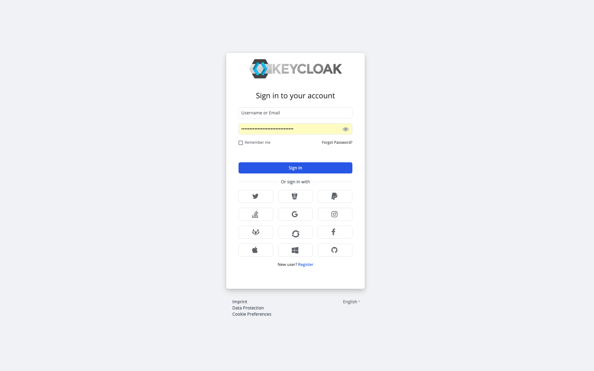

<p align="center">
    <i>🚀 <a href="https://github.com/ALMiG-Kompressoren-GmbH/tailcloakify">Tailcloakify</a> V1  🚀</i>
    <br/>
    <br/>
</p>


Tailcloakify is a [Keycloak](https://github.com/keycloak/keycloak) Theme that is based on 
[Keycloakify](https://github.com/keycloakify/keycloakify), layered with [TailwindCSS](https://github.com/tailwindlabs/tailwindcss) and inspired by [Keywind](https://github.com/lukin/keywind) 
UI design approach.

# How to Use

1. Place the provided JAR file in the <keycloak-home>/providers/ directory or use the example Dockerfile from this repository to add the provided JAR file into your Docker Image.
2. Set environment variables or localization messages to customize the theme with the out of the box configuration functionalities.
3. Restart your Keycloak server or deploy your builded docker image to your server.
4. Log in to the Keycloak Admin Console.  
Go to Realm Settings > Themes.  
Select the Tailcloakify login theme from the dropdown.  
Save your settings.

## Customizing the Theme

Tailcloakify provides ways of customizing your theme without the need to rebuild the theme while using a prebundled JAR file. This could include adding a background video/logo or customizing the footer behavior.

## Environment variables

| Name                                        | Description                                                                  |
| ------------------------------------------- |------------------------------------------------------------------------------|
| TAILCLOAKIFY_ADDITIONAL_SCRIPTS             | Use it to add other external scripts                                         |
| TAILCLOAKIFY_BACKGROUND_LOGO_URL            | Use it to add an image of your logo                                          |
| TAILCLOAKIFY_BACKGROUND_VIDEO_URL           | Use it to add a MP4 format background video on your register and login pages |
| TAILCLOAKIFY_FAVICON_URL                    | Use it to add a url to your Favicon                                          |
| TAILCLOAKIFY_FOOTER_IMPRINT_URL             | Use it to add an Impressum                                                   |
| TAILCLOAKIFY_FOOTER_DATAPROTECTION_URL      | Use it to add url to your data protection document                           |
| TAILCLOAKIFY_FOOTER_ORESTBIDACOOKIECONSENT  | Use it to integrate Orestbida cookie consent plugin                          |
| TAILCLOAKIFY_FOOTER_ORESTBIDACOOKIECONSENT_GOOGLE_CAPTCHA  | Provide any falsy value to disable the cookie section for the google captcha                          |

## Keycloak localization feature

Some customizations are possible through Keycloak's Localization System, allowing setting up different configurations for each language. You can either add custom localization by adding those into the keycloak server or by manually setting them within the realm settings.

| Name                     | Description                                                                        |
| ------------------------ | ---------------------------------------------------------------------------------- |
| backgroundLogoUrl        | The localized enabled alternative to env: TAILCLOAKIFY_BACKGROUND_LOGO_URL         |
| backgroundVideoUrl       | The localized enabled alternative to env: TAILCLOAKIFY_BACKGROUND_VIDEO_URL        |
| faviconUrl               | The localized enabled alternative to env: TAILCLOAKIFY_FAVICON_URL                 |
| footerImprintUrl         | The localized enabled alternative to env: TAILCLOAKIFY_FOOTER_IMPRINT_URL          |
| footerDataprotectionUrl  | The localized enabled alternative to env: TAILCLOAKIFY_FOOTER_DATAPROTECTION_URL   |

# Developer Quick Start

If you want to customize the theme beyond the outlined capabilities, you can do so by forking this repository and performing manual changes yourself.

Here do you find a Quick Start, how to setup your development environment:

```bash
  git clone https://github.com/ALMiG-Kompressoren-GmbH/tailcloakify
  cd tailcloakify
  yarn install  # Or use an other package manager, just be sure to delete the yarn.lock if you use another package manager.
```

## Testing the Theme Locally

```bash
  npm run dev
```

Alternatively, to run the theme locally via Keycloak:

```bash
  npx keycloakify start-keycloak
```

Or you can preview the pages using the storybook:

```bash
  npm run storybook
```

## Building the theme

You need to have [Maven](https://maven.apache.org/) installed to build the theme (Maven >= 3.1.1, Java >= 7).  
The `mvn` command must be in the $PATH.

- On macOS: `brew install maven`
- On Debian/Ubuntu: `sudo apt-get install maven`
- On Windows: `choco install openjdk` and `choco install maven` (Or download from [here](https://maven.apache.org/download.cgi))

```bash
  npm run build-keycloak-theme
```

Note that by default Keycloakify generates multiple `.jar` files for different versions of Keycloak.  

## GitHub Actions

Tailcloakify comes with a generic GitHub Actions workflow that builds the theme and publishes
the jars [as GitHub releases artifacts](https://github.com/ALMiG-Kompressoren-GmbH/tailcloakify/releases/tag/v1.1.5).  
To release a new version **just update the `package.json` version and push**.

To enable the workflow go to your fork of this repository on GitHub then navigate to:
`Settings` > `Actions` > `Workflow permissions`, select `Read and write permissions`.

# Contributing

If you would like to introduce additional changes, please read the [Contributing Guidelines](CONTRIBUTING.md).

# Code of Conduct

Anyone who interacts with Tailcloakify in any space, including but not limited to this GitHub repository, must follow
our [Code of Conduct](CODE_OF_CONDUCT.md).

# License

Licensed under the [MIT License](LICENSE).

# Authors

[Paul Werner](https://github.com/paulwer)

[Wayne Kirimi](https://github.com/waynemorphic)
