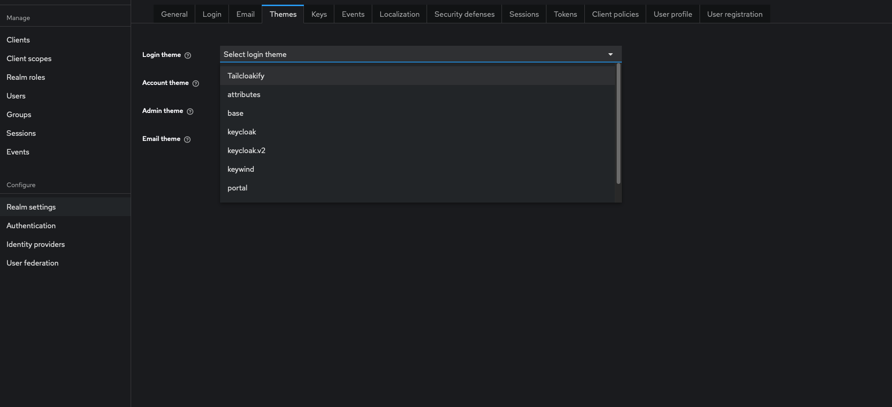

<p align="center">
    <i>🚀 <a href="https://github.com/ALMiG-Kompressoren-GmbH/tailcloakify">Tailcloakify</a> V1  🚀</i>
    <br/>
    <br/>
</p>


Tailcloakify is a [Keycloak](https://github.com/keycloak/keycloak) Theme that is based on 
[Keycloakify](https://github.com/keycloakify/keycloakify) + Vite, layered with TailwindCSS and inspired by [Keywind](https://github.com/lukin/keywind) 
UI design approach.

# Quick Start

```bash
  git clone https://github.com/ALMiG-Kompressoren-GmbH/tailcloakify
  cd tailcloakify
  yarn install  # Or use an other package manager, just be sure to delete the yarn.lock if you use another package manager.
```

# Testing the Theme Locally

```bash
  npm run dev
```

Alternatively, to run the theme locally via Keycloak:

```bash
  npx keycloakify start-keycloak
```

# Customizing the Theme

Tailcloakify has seamless ways of customizing your Login page. This could include adding a background video to your Login and
Register pages or a logo. 

After navigating to the `vite.config.ts` file, several environment variables have been 
provided that ensure that you do not have to rework the code for your configuration. These environment variables are:

```
    TAILCLOAKIFY_ADDITIONAL_SCRIPTS :- Use it to add other external scripts 
    TAILCLOAKIFY_BACKGROUND_LOGO_URL :- Use it to add an image of your logo 
    TAILCLOAKIFY_BACKGROUND_VIDEO_URL :- Use it to add a MP4 format background video on your register and login pages
    TAILCLOAKIFY_FOOTER_IMPRINT_URL :- Use it to add an Impressum 
    TAILCLOAKIFY_FOOTER_DATAPROTECTION_URL :- Use it to add url to your data protection document  
    TAILCLOAKIFY_FOOTER_ORESTBIDACOOKIECONSENT :- Use it to integrate Orestbida cookie consent plugin 
```

## Docker Config

Normally, you would test Keycloak and any associated custom themes by running docker. Therefore, using docker requires 
that you build the theme into a `jar` so that Keycloak is able to recognize the custom theme.

### Building the theme

You need to have [Maven](https://maven.apache.org/) installed to build the theme (Maven >= 3.1.1, Java >= 7).  
The `mvn` command must be in the $PATH.

- On macOS: `brew install maven`
- On Debian/Ubuntu: `sudo apt-get install maven`
- On Windows: `choco install openjdk` and `choco install maven` (Or download from [here](https://maven.apache.org/download.cgi))

```bash
  npm run build-keycloak-theme
```

Note that by default Keycloakify generates multiple `.jar` files for different versions of Keycloak.  

### Sample Dockerfile Configs

```Dockerfile
# Use Keycloak Container
FROM quay.io/keycloak/keycloak:26.0.7 as builder

# Install custom theme
COPY https://github.com/ALMiG-Kompressoren-GmbH/tailcloakify/releases/download/v1.0.0/keycloak-theme-for-kc-22-to-25.jar /opt/keycloak/keycloak-theme-for-kc-22-to-25.jar

FROM quay.io/keycloak/keycloak:26.0.7

COPY --from=builder /opt/keycloak /opt/keycloak
WORKDIR /opt/keycloak

ENV KC_HOSTNAME_STRICT=false
ENV KC_HTTPS_PORT=8443
ENV KC_HTTPS_PROTOCOLS=TLSv1.3,TLSv1.2
ENV KC_HTTP_ENABLED=true
ENV KC_HTTP_PORT=8080
ENV KC_BOOTSTRAP_ADMIN_USERNAME=admin
ENV KC_BOOTSTRAP_ADMIN_PASSWORD=admin

ENTRYPOINT ["/opt/keycloak/bin/kc.sh", "start"]

```

### Keycloak Console Config

After successfully building the theme and running docker, you can navigate to Keycloak console to set your theme. Under 
Realm settings -> Themes, click the Login theme dropdown to access the template. Pick `Tailcloakify` then click save.



# Contributing

If you would like to introduce additional changes, please read the [Contributing Guidelines](CONTRIBUTING.md).

# GitHub Actions

Tailcloakify comes with a generic GitHub Actions workflow that builds the theme and publishes
the jars [as GitHub releases artifacts](https://github.com/ALMiG-Kompressoren-GmbH/tailcloakify/releases/tag/v1.0.0).  
To release a new version **just update the `package.json` version and push**.

To enable the workflow go to your fork of this repository on GitHub then navigate to:
`Settings` > `Actions` > `Workflow permissions`, select `Read and write permissions`.

# Code of Conduct
Anyone who interacts with Tailcloakify in any space, including but not limited to this GitHub repository, must follow
our [Code of Conduct](CODE_OF_CONDUCT.md).

# License

Licensed under the [MIT License](LICENSE).

# Authors

[Paul Werner](https://github.com/paulwer)

[Wayne Kirimi](https://github.com/waynemorphic)