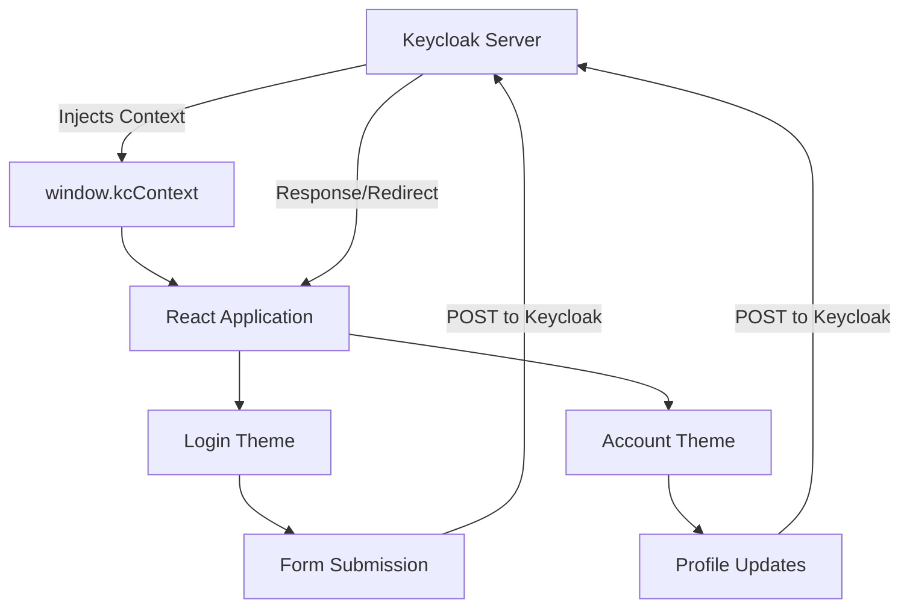
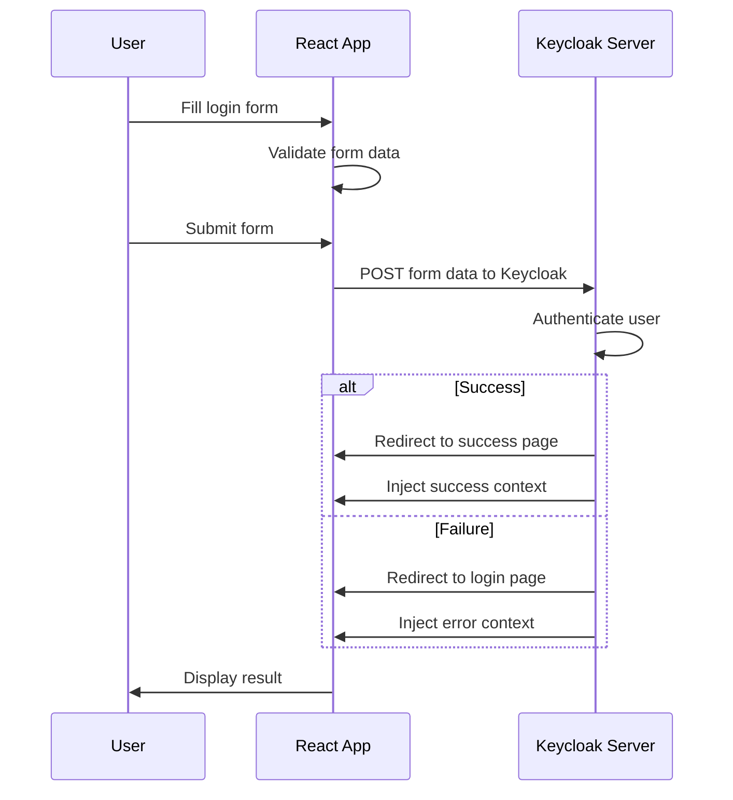
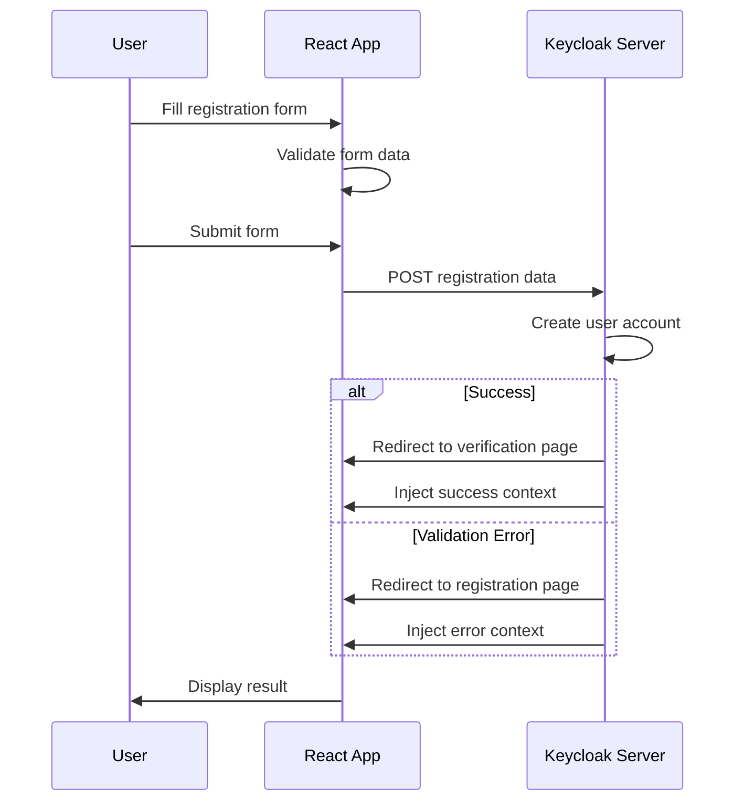
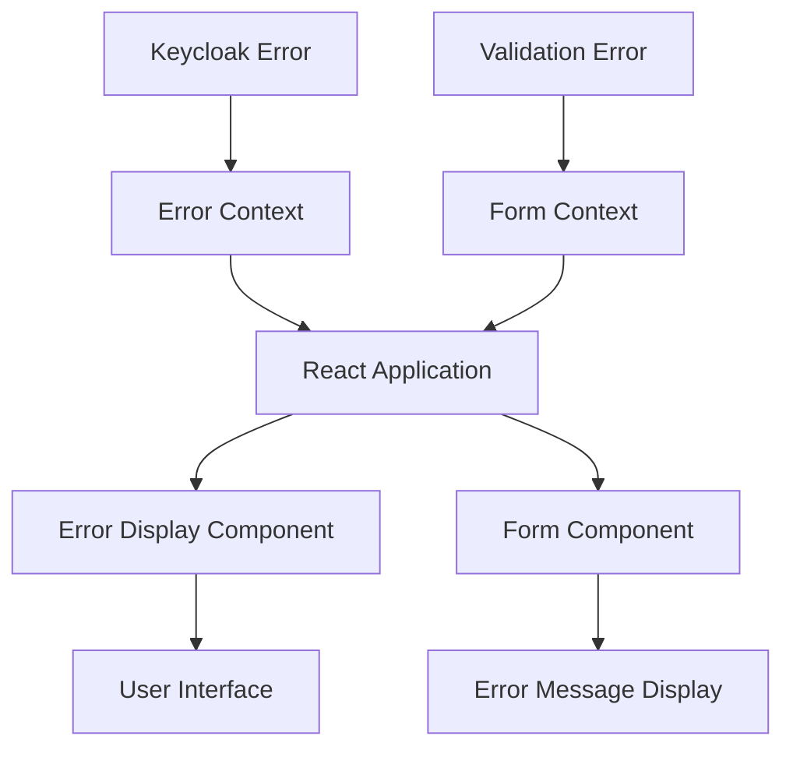

# Data Flow

This document describes the data flow patterns, API interactions, and state management in the Keycloakify project.

## Overview

The Keycloakify project follows a simple data flow pattern where Keycloak handles all backend operations and injects context data into the frontend application. The React application primarily consumes and displays this data without making direct API calls.

## Data Flow Architecture



## Keycloak Context Injection

### Context Structure

The primary data source is `window.kcContext`, which Keycloak injects into the page:

```typescript
interface KcContext {
    themeType: "login" | "account";
    pageId: string;
    realm: string;
    auth: AuthData;
    url: URLData;
    message: MessageData;
    properties: Record<string, string>;
    themeName: ThemeName;
}
```

### Context Flow

1. **Keycloak Server** processes authentication requests
2. **Context Generation** - Keycloak creates context with current state
3. **Page Rendering** - Keycloak renders the theme page
4. **Context Injection** - `window.kcContext` is populated
5. **React Hydration** - React application reads context and renders

## Form Data Flow

### Login Form Flow



### Registration Form Flow



## State Management

### Global State

The application uses a simple state management approach:

1. **Keycloak Context**: `window.kcContext` (read-only)
2. **Component State**: React's `useState` for local state
3. **Form State**: Managed by Keycloakify components

### State Flow Patterns

```typescript
// Global context (read-only)
const kcContext = window.kcContext;

// Local component state
const [localState, setLocalState] = useState(initialValue);

// Form state (managed by Keycloakify)
const { i18n } = useI18n({ kcContext });
```

### No External State Management

The project intentionally avoids external state management libraries:

- **No Redux**: Simple context is sufficient
- **No Zustand**: Local state meets requirements
- **No Context API**: Keycloak provides global context

## API Endpoints

### Keycloak-Managed Endpoints

The application doesn't make direct API calls. Instead, Keycloak handles all endpoints:

| Endpoint | Method | Purpose | Data Flow |
|----------|--------|---------|-----------|
| `/auth/realms/{realm}/protocol/openid-connect/auth` | GET | Authentication initiation | Keycloak → React (context) |
| `/auth/realms/{realm}/protocol/openid-connect/token` | POST | Token exchange | Keycloak → React (context) |
| `/auth/realms/{realm}/protocol/openid-connect/logout` | POST | Logout | Keycloak → React (context) |
| `/auth/realms/{realm}/account` | GET | Account management | Keycloak → React (context) |

### Form Submission Endpoints

Forms submit to Keycloak-managed endpoints:

```typescript
// Login form submission
<form action={kcContext.url.loginAction} method="post">
    <input name="username" value={username} />
    <input name="password" type="password" />
    <button type="submit">Sign In</button>
</form>

// Registration form submission
<form action={kcContext.url.registrationUrl} method="post">
    <input name="firstName" value={firstName} />
    <input name="lastName" value={lastName} />
    <input name="email" value={email} />
    <button type="submit">Register</button>
</form>
```

## Data Transformation

### Context to Component Props

```typescript
// Extract relevant data from context
const { kcContext } = props;
const { auth, url, message } = kcContext;

// Transform for component use
const userData = auth.user;
const formAction = url.loginAction;
const errorMessage = message?.summary;
```

### Internationalization Data Flow

```typescript
// i18n data flows from context to components
const { i18n } = useI18n({ kcContext });

// Translation strings are available throughout the app
const loginButtonText = i18n.doLogIn;
const usernameLabel = i18n.username;
```

## Error Handling

### Error Data Flow



### Error Types

1. **Authentication Errors**: Invalid credentials, account locked
2. **Validation Errors**: Form validation failures
3. **System Errors**: Server errors, network issues
4. **Session Errors**: Expired sessions, invalid tokens

### Error Handling Pattern

```typescript
// Error data from context
const { message } = kcContext;

// Display error if present
if (message?.type === "error") {
    return <ErrorMessage message={message.summary} />;
}
```

## Data Validation

### Client-Side Validation

```typescript
// Form validation using Keycloakify components
<UserProfileFormFields
    kcContext={kcContext}
    onIsFormSubmittable={setIsFormSubmittable}
    displayMessage={displayMessage}
/>
```

### Server-Side Validation

- **Keycloak handles all validation**
- **Validation errors returned in context**
- **No custom validation logic needed**

## Performance Considerations

### Data Loading

1. **No API Calls**: Data is pre-loaded by Keycloak
2. **No Loading States**: Context is immediately available
3. **No Caching**: Fresh data on each page load

### Optimization Strategies

1. **Lazy Loading**: Components loaded on demand
2. **Code Splitting**: Separate bundles for login/account themes
3. **Minimal Re-renders**: Context changes trigger targeted updates

## Security Considerations

### Data Security

1. **No Sensitive Data Storage**: Keycloak handles all sensitive data
2. **Context Validation**: TypeScript ensures data integrity
3. **XSS Prevention**: React's built-in XSS protection

### Form Security

1. **CSRF Protection**: Keycloak provides CSRF tokens
2. **Input Sanitization**: Keycloakify components handle sanitization
3. **Secure Submission**: Forms submit to Keycloak endpoints

## Development Data Flow

### Storybook Mock Data

```typescript
// Mock context for development
const mockContext = getKcContextMock({
    pageId: "login.ftl",
    overrides: {
        auth: {
            attemptedUsername: "testuser",
            error: "Invalid credentials"
        }
    }
});
```

### Development Workflow

1. **Local Development**: Use Storybook with mock data
2. **Testing**: Test with real Keycloak context
3. **Production**: Deploy to Keycloak server

## Monitoring and Debugging

### Context Inspection

```typescript
// Debug context in development
if (import.meta.env.DEV) {
    console.log("Keycloak Context:", window.kcContext);
}
```

### Data Flow Debugging

1. **Browser DevTools**: Inspect `window.kcContext`
2. **React DevTools**: Monitor component props
3. **Network Tab**: Monitor form submissions

This data flow architecture ensures simplicity, security, and maintainability while leveraging Keycloak's robust backend capabilities.
