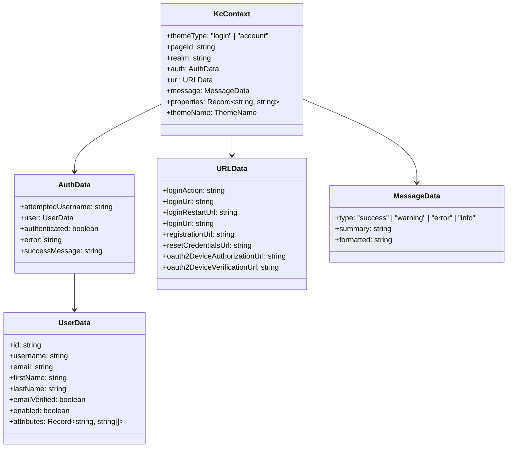
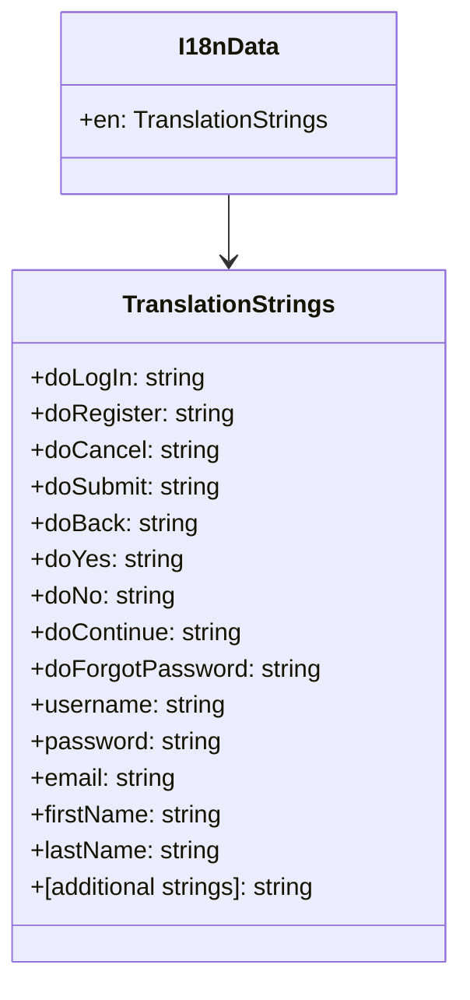
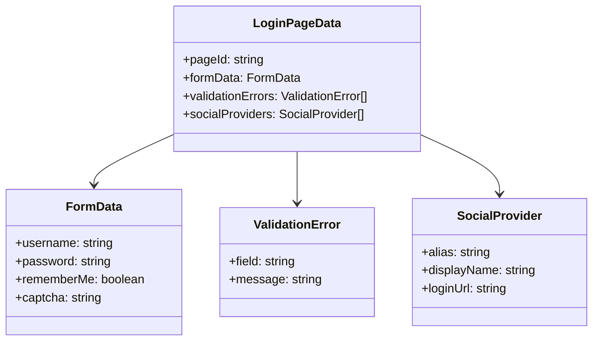
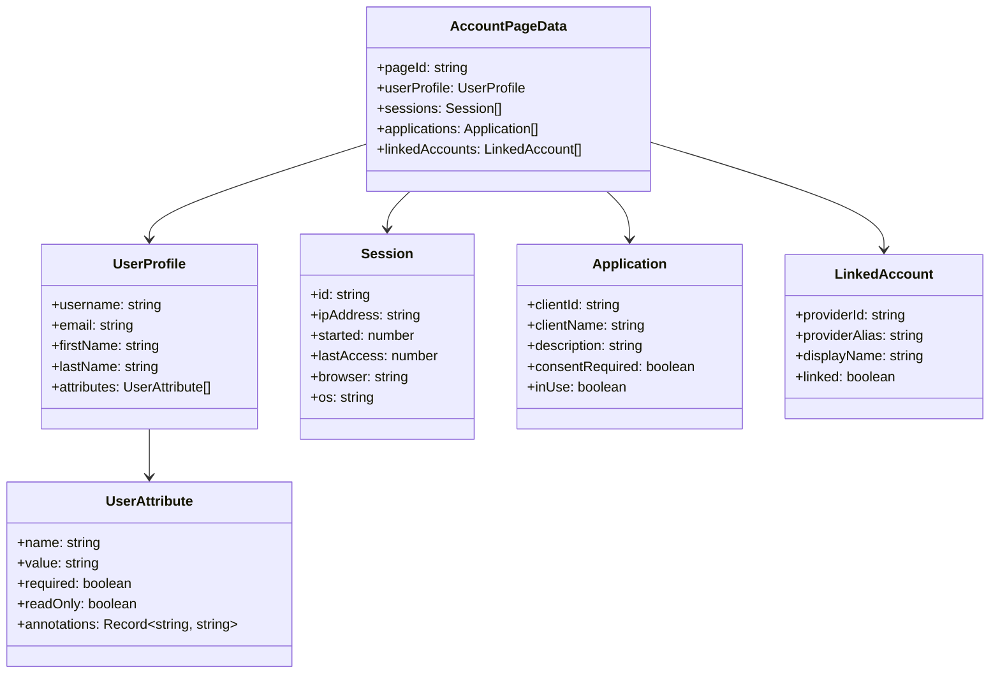
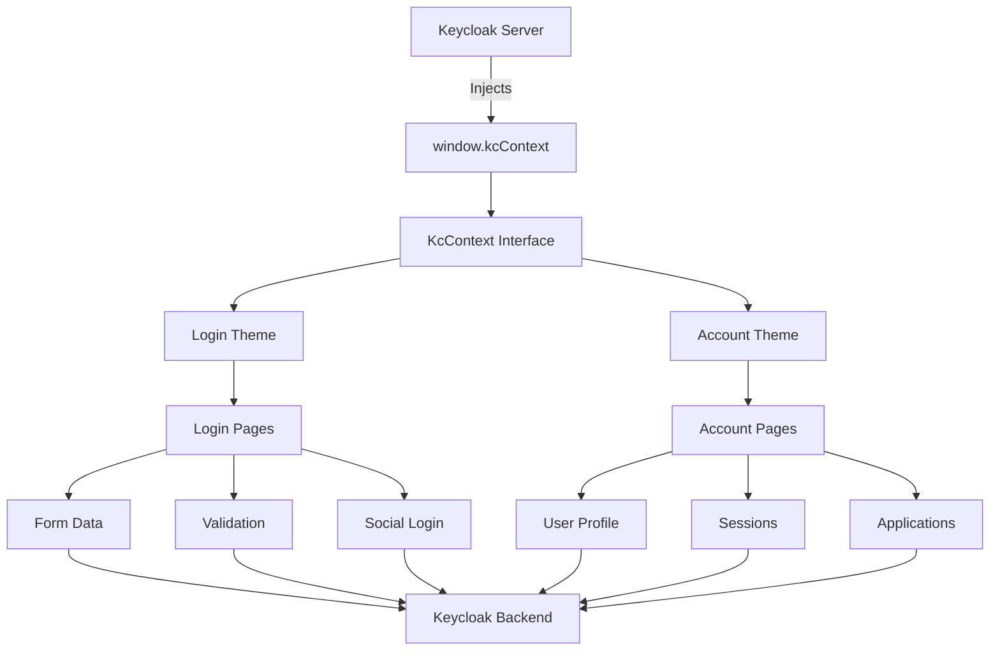

# Entities Diagram

This document provides a visual representation of the data entities and their relationships in the Keycloakify project.

## Overview

The Keycloakify project primarily deals with authentication and user management data structures provided by Keycloak. The main entities are defined through TypeScript interfaces and Keycloakify's type system.

## Core Data Models

### 1. KcContext (Keycloak Context)

The central data structure that contains all authentication and user information.



### 2. Theme Configuration

```mermaid
classDiagram
    class ThemeName {
        +value: "keycloakify"
    }

    class KcEnvName {
        +value: never
    }

    class KcContextExtension {
        +themeName: ThemeName
        +properties: Record~KcEnvName, string~
    }

    class KcContextExtensionPerPage {
        +empty: {}
    }

    KcContextExtension --> ThemeName
    KcContextExtension --> KcEnvName
```

### 3. Internationalization (i18n) Structure



## Page-Specific Data Models

### Login Theme Pages



### Account Theme Pages



## Data Flow Relationships



## File Mappings

### TypeScript Interface Files

| Entity | File Location | Description |
|--------|---------------|-------------|
| `KcContext` | `src/login/KcContext.ts` | Login theme context interface |
| `KcContext` | `src/account/KcContext.ts` | Account theme context interface |
| `ThemeName` | `src/kc.gen.ts` | Auto-generated theme names |
| `KcEnvName` | `src/kc.gen.ts` | Auto-generated environment names |

### Data Structure Files

| Data Type | File Location | Description |
|-----------|---------------|-------------|
| Login i18n | `src/login/i18n.ts` | Login theme translations |
| Account i18n | `src/account/i18n.ts` | Account theme translations |
| Global types | `src/kc.gen.ts` | Auto-generated Keycloakify types |

## Key Relationships

### 1. Context Inheritance

```typescript
// Base Keycloakify context
ExtendKcContext<KcContextExtension, KcContextExtensionPerPage>

// Custom extensions
KcContextExtension = {
    themeName: ThemeName;
    properties: Record<KcEnvName, string> & {};
}
```

### 2. Theme Type Mapping

```typescript
// Theme type determines which components to render
switch (window.kcContext?.themeType) {
    case "login":   // → Login theme components
    case "account": // → Account theme components
}
```

### 3. Page Routing

```typescript
// Page ID determines specific page component
switch (kcContext.pageId) {
    case "login.ftl":        // → Login form
    case "register.ftl":     // → Registration form
    case "info.ftl":         // → Information page
    case "error.ftl":        // → Error page
    // ... other pages
}
```

## Data Validation

### Form Validation

- **Client-side**: React form validation using Keycloakify components
- **Server-side**: Keycloak handles all authentication validation
- **Error Handling**: Validation errors are passed through `kcContext.message`

### Type Safety

- **TypeScript**: Full type safety for all data structures
- **Interface Contracts**: Clear contracts between components
- **Auto-generation**: Keycloakify generates type definitions automatically

## State Management

The project uses a simple state management approach:

1. **Global State**: `window.kcContext` (injected by Keycloak)
2. **Component State**: React's `useState` for local component state
3. **Form State**: Managed by Keycloakify's form components
4. **No External State**: No Redux, Zustand, or other state management libraries

This design ensures simplicity and leverages Keycloak's built-in state management capabilities.
